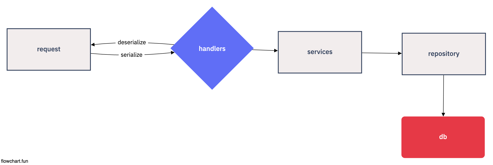

# Golang-MicroService

## Folder-Architecture (3 layer architecture)



```
    |-- src
        |-- handlers            // handler layers
        |-- modules             // db, redis, third party lib
        |-- repositories        // db layer
        |-- routers             // router layer
        |-- services            // service layer
        |-- utils               // logger, type, error utils
```

## Reference

- <a href="https://docs.gofiber.io/api/fiber"> Fiber </a>
